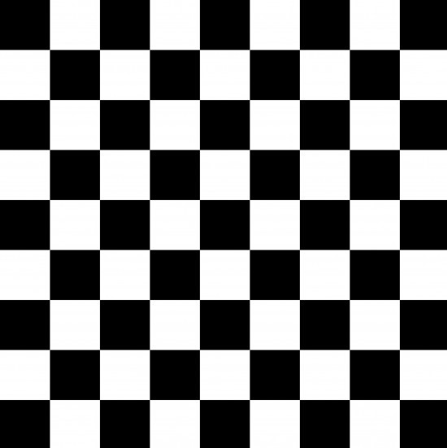
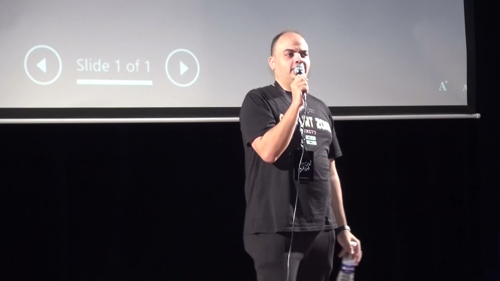
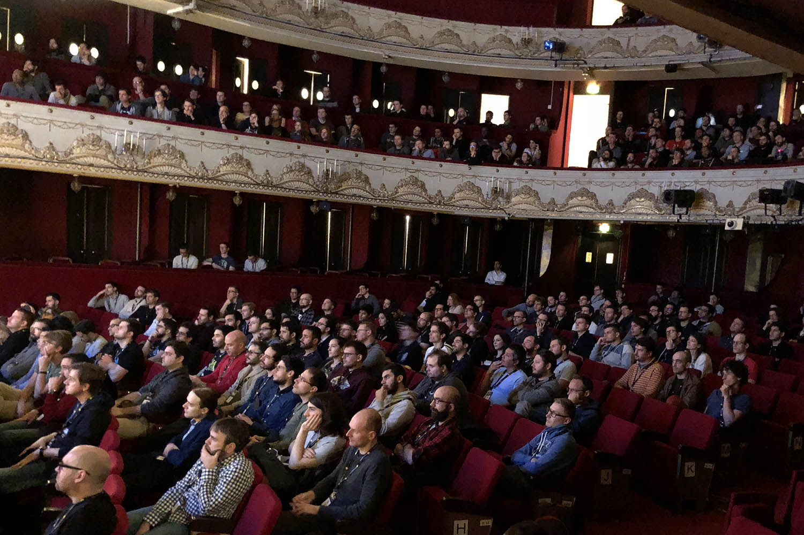

html icon
<i class="fa-brands fa-html5"></i>
css icon
<i class="fa-brands fa-css3-alt"></i>
js icon
<i class="fa-brands fa-js"></i>
browser icon
<i class="fa-light fa-browsers"></i>
projects dumbbell icon
<i class="fa-light fa-dumbbell"></i>

nav bars icon
<i class="fa-solid fa-bars"></i>

h1>> Ultimate Arabic front-end course.

p >> the ultimate front-end courses for arabic speakers, best Arabic "speakers" in the web development that give you the tools and knowledge to go further.

p >> taking place in may in Egypt.

<!-- js code -->

// menu section logic
const navOpen = document.querySelector(".navbar-toggler");
const navClose = document.querySelector(".close-btn-wrapper");
const menuElement = document.querySelector(".menu");
const linksAction = menuElement.querySelectorAll("a");

navOpen.addEventListener("click", () => {
menuElement.classList.remove("hidden");
document.querySelector("body").classList.add("overflow-hidden");
});

navClose.addEventListener("click", () => {
menuElement.classList.add("hidden");
document.querySelector("body").classList.remove("overflow-hidden");
});

linksAction.forEach((node) => {
node.onclick = () => {
menuElement.classList.add("hidden");
document.querySelector("body").classList.remove("overflow-hidden");
};
});

// speakers Section data and logic

const speakers = [
{
name: "Ghareeb Elshaikh",
textOne: `programer and content Creator `,
textTwo: `self-tough programmer and youtube content maker.`,
imageOne: "imgs/squares-black-white.jpg",
imageTwo: "imgs/ghareeb-2.jpg",
},
{
name: "Osama Mohammed",
textOne: ` Number #1 Arabic programer and content Creator at youtube`,
textTwo: `self-tough programmer and youtube content maker he create full
courses by his self.`,
imageOne: "imgs/squares-black-white.jpg",
imageTwo: "imgs/elzero.jpg",
},
{
name: "Ali Shahin",
textOne: `programer and content Creator`,
textTwo: `self-tough programmer and youtube content maker.`,
imageOne: "imgs/squares-black-white.jpg",
imageTwo: "imgs/ali.jpg",
},
{
name: "Islam Hesham",
textOne: `programer and content Creator`,
textTwo: `self-tough programmer and youtube content maker.`,
imageOne: "imgs/squares-black-white.jpg",
imageTwo: "imgs/islam.jpg",
},
{
name: "Mohamed Abusrea",
textOne: `programer and content Creator`,
textTwo: `self-tough programmer and youtube content maker.`,
imageOne: "imgs/squares-black-white.jpg",
imageTwo: "imgs/mohamed.jpg",
},
{
name: "Ahmed Abouzaid",
textOne: `content Creator in productivity , time management and
self-development`,
textTwo: `most famous arabic speaker in productivity and
self-development with more then 6m subscriber on youtube.`,
imageOne: "imgs/squares-black-white.jpg",
imageTwo: "imgs/Ahmed.jpg",
},
];

<!-- js code -->

<!-- html file -->

<!DOCTYPE html>
<html lang="en">
  <head>
    <meta charset="UTF-8" />
    <meta http-equiv="X-UA-Compatible" content="IE=edge" />
    <meta name="viewport" content="width=device-width, initial-scale=1.0" />
    <!-- Bootstrap Css file -->
    <link rel="stylesheet" href="css/bootstrap.min.css" />
    <!-- FontsAwesome Css file -->
    <link rel="stylesheet" href="css/all.min.css" />
    <!-- Master Css file -->
    <link rel="stylesheet" href="css/master.css" />
    <!-- Fonts -->
    <link rel="preconnect" href="https://fonts.googleapis.com" />
    <link rel="preconnect" href="https://fonts.gstatic.com" crossorigin />
    <link
      href="https://fonts.googleapis.com/css2?family=Lato:wght@100;300;400;700;900&display=swap"
      rel="stylesheet"
    />
    <link href="http://fonts.cdnfonts.com/css/cocogoose" rel="stylesheet" />

    <title>Ultimate Arabic front-end course 2022</title>

  </head>
  <body>
    <!-- menu section -->
    <section class="menu hidden">
      

        <button class="close-btn">
          
        </button>
      

      

        <ul>
          <li><a href="about.html">About</a></li>
          <li><a href="#program">Program</a></li>
          <li><a href="#join">Join</a></li>
          <li><a href="#sponsor">Sponsor</a></li>
          <li><a href="#news">News</a></li>
          <li><a href="#contact">Contact</a></li>
        </ul>
      

    </section>
    <!-- first nav section -->
    <nav class="first-nav">
      

        <ul>
          <li>
            <a href="#"><i class="fa-brands fa-facebook-f"></i></a>
          </li>
          <li>
            <a href="#"><i class="fa-brands fa-twitter"></i></a>
          </li>
          <li><a href="#">English</a></li>
          <li><a href="#">My Page</a></li>
          <li><a href="#">Logout</a></li>
        </ul>
      

    </nav>
    <!-- main bar section -->
    <nav class="navbar navbar-expand-md">
      

        
        <button class="navbar-toggler p-0">
          <i class="fa-solid fa-bars menu-btn"></i>
        </button>
        

          <ul class="navbar-nav ms-auto">
            <li class="nav-item">
              <a class="nav-link active" href="about.html">About</a>
            </li>
            <li class="nav-item">
              <a class="nav-link" aria-current="page" href="#program"
                >Program</a
              >
            </li>
            <li class="nav-item">
              <a class="nav-link" aria-current="page" href="#">Join</a>
            </li>
            <li class="nav-item">
              <a class="nav-link" aria-current="page" href="#sponsor"
                >Sponsor</a
              >
            </li>
            <li class="nav-item">
              <a class="nav-link" href="#">News</a>
            </li>
          </ul>
        

        
UC Campaign

      

    </nav>
    <!-- header section -->
    <section class="header">
      

        <section class="headline">
          <h2 class="welcome">"Hello! Future Programers"</h2>
          <h1 class="title">Ultimate Arabic front-end course 2022</h1>
          

            The ultimate front-end courses for arabic speakers, best Arabic
            "speakers" in the web development that give you the tools and
            knowledge to go further.
          

          <h1 class="date">2022.5.25(WED) ~ 28(SAT)</h1>
          
@ national museum Cairo center

        </section>
      

    </section>
    <!-- main program section -->
    <section class="main-program" id="program">
      

        <h1 class="section-title">Main Program</h1>
        

          

            

              <h5 class="card-icon"><i class="fa-brands fa-html5"></i></h5>
              <h5 class="card-title">HTML</h5>
              

                HTML is the standard markup language for creating Web pages.
              

            

          

          

            

              <h5 class="card-icon"><i class="fa-brands fa-css3-alt"></i></h5>
              <h5 class="card-title">Css</h5>
              

                CSS is the language we use to style an HTML document.
              

            

          

          

            

              <h5 class="card-icon"><i class="fa-brands fa-js"></i></h5>
              <h5 class="card-title">Javascript</h5>
              

                JavaScript is the programming language of the Web.
              

            

          

          

            

              <h5 class="card-icon"><i class="fa-brands fa-bootstrap"></i></h5>
              <h5 class="card-title">Frameworks</h5>
              

                A framework that is designed to support web applications
                development
              

            

          

          

            

              <h5 class="card-icon"><i class="fa-regular fa-clipboard"></i></h5>
              <h5 class="card-title">Assignments</h5>
              

                Apply your knowledge on projects and assignments.
              

            

          

        

        

          <a href="#" class="join-link">Join The Ultimate Course</a>
        

        <a href="#" class="see-link d-none d-md-block">See the Whole program</a>
      

    </section>
    <!-- feature speaker section -->

    <section class="feature-speakers">
      

        <h1 class="section-title">Feature Speakers</h1>
        

          

            

              

                
                
              

              

                <h3>Ghareeb Elshaikh</h3>
                
programer and content Creator

                

                

                  self-tough programmer and youtube content maker.
                

              

            

          

          

            

              

                
                
              

              

                <h3>Osama Mohammed</h3>
                

                  Number #1 Arabic programer and content Creator at youtube
                

                

                

                  self-tough programmer and youtube content maker he create full
                  courses by his self.
                

              

            

          

          

            

              

                
                
              

              

                <h3>Ali Shahin</h3>
                
programer and content Creator

                

                

                  self-tough programmer and youtube content maker.
                

              

            

          

          

            

              

                
                
              

              

                <h3>Islam Hesham</h3>
                
programer and content Creator

                

                

                  self-tough programmer and youtube content maker.
                

              

            

          

          

            

              

                
                
              

              

                <h3>Mohamed Abusrea</h3>
                
programer and content Creator

                

                

                  self-tough programmer and youtube content maker.
                

              

            

          

          

            

              

                
                
              

              

                <h3>Ahmed Abouzaid</h3>
                

                  content Creator in productivity , time management and
                  self-development
                

                

                

                  most famous arabic speaker in productivity and
                  self-development with more then 6m subscriber on youtube.
                

              

            

          

        

        <!-- 

          <button>More <i class="fa-solid fa-angle-down"></i></button>
        
 -->
      

    </section>

    <!-- partner section -->
    <section class="partners-section d-md-flex" id="sponsor">
      

        <h1 class="section-title">Partners</h1>
        

          

            
            
            
          

          

            
            
          

        

      

    </section>
    <!-- footer section -->
    <footer class="footer">
      

        

          
          

            Ultimate Arabic Frontend Course  
            Some Right Reserved.
          

        

      

    </footer>
    

  </body>
</html>
<!-- html home file -->

<!-- maste .css -->

/_ global variables _/
:root {
--color-one-: #272a31;
--color-two-: #ec5242;
--color-Three-: #d3d3d3;
--coco-font-: "COCOGOOSE", sans-serif;
--lato-font-: "Lato", sans-serif;
}

- {
  box-sizing: border-box;
  -webkit-box-sizing: border-box;
  }

.hidden {
display: none;
}

.section-title {
font-size: 24px;
color: var(--color-one-);
position: relative;
text-align: center;
width: fit-content;
margin: 0 auto 40px;
}

.section-title::after {
content: "";
height: 1px;
width: 12%;
background-color: var(--color-two-);
position: absolute;
bottom: -30%;
right: 44%;
}

@media (min-width: 768px) {
.container {
padding: 0 50px;
}

.header,
.main-program,
.feature-speakers,
.partners-section,
footer {
padding: 60px;
}
}

/_ global variables _/
.menu {
z-index: 99;
width: 100%;
position: fixed;
height: 100vh;
background-color: transparent;
background-image: url(../imgs/footer-bar.svg);
background-position: bottom 10px center;
background-repeat: no-repeat;
}

.close-btn-wrapper {
height: 50px;
display: flex;
flex-direction: row-reverse;
background-color: rgba(60, 58, 57, 0.98);
}

.close-btn-wrapper .close-btn {
border: none;
background-color: inherit;
}

.close-btn-wrapper .close-btn:hover {
cursor: pointer;
}

.menu .links-con {
background-color: rgba(60, 58, 57, 0.98);
height: 85vh;
padding: 15px;
}

.menu ul {
list-style: none;
padding: 0;
margin: 0;
}

.menu li {
padding: 10px;
margin-bottom: 10px;
border-bottom: 1px rgba(111, 108, 107, 1) solid;
}

.menu a {
text-decoration: none;
color: white;
font-family: "Inter", sans-serif;
font-weight: 700;
font-size: 32px;
}

/_ first nav section _/
.first-nav {
background-color: var(--color-one-);
color: white;
font-size: 13px;
height: 30px;
display: flex;
align-items: center;
}

.first-nav ul {
list-style: none;
margin: 0;
display: flex;
justify-content: flex-end;
}

.first-nav li {
list-style: none;
margin-left: 15px;
}

.first-nav a {
text-decoration: none;
color: inherit;
font-family: var(--lato-font-);
}

@media (max-width: 767px) {
.first-nav {
display: none;
}
}

/_ main nav section _/

.navbar {
background-color: white;
height: 75px;
}

.navbar a {
color: var(--color-one-);
}

.navbar .active {
color: var(--color-two-);
}

.navbar li {
margin: 0 10px;
}

.nav-logo img {
max-width: 80px;
}

.nav-link:focus,
.nav-link:hover {
color: var(--color-two-);
}

.comp-name {
border: solid 5px var(--color-two-);
color: var(--color-two-);
padding: 5px;
}

.menu-btn {
font-size: 50px;
}

@media (max-width: 767px) {
.comp-name,
.nav-logo {
display: none;
}

.navbar {
background-color: transparent;
height: 0;
padding: 0;
}
}

/_ header section _/
.header {
background-image: url(../imgs/Website-background.png);
background-size: cover;
background-position: center;
padding: 60px 0;
}

.welcome {
color: var(--color-two-);
font-size: 24px;
margin-top: 25px;
font-family: var(--lato-font-);
}

.title {
color: var(--color-two-);
font-size: 35px;
font-family: var(--coco-font-);
background-image: url(../imgs/fire-bg.jpg);
-webkit-background-clip: text;
-webkit-text-fill-color: transparent;
background-position: 60% 68%;
}

.first-p {
border: solid 1px white;
background-color: #f6f6f7;
margin: 20px 0 15px;
padding: 15px;
font-family: var(--lato-font-);
color: var(--color-one-);
}

.date {
color: var(--color-one-);
font-size: 24px;
font-family: var(--coco-font-);
}

.sec-p {
font-family: var(--lato-font-);
text-transform: capitalize;
color: var(--color-one-);
}

/_ header section quires _/
@media (min-width: 768px) {
.header {
background-size: contain;
}

.welcome {
font-size: 30px;
}

.title {
font-size: 45px;
width: 80%;
text-transform: uppercase;
}

.first-p {
width: 60%;
}
}

/_ main program section _/

.main-program {
background-image: url(../imgs/program-bg.jpg);
padding: 30px 0;
}

.main-program .section-title {
color: white;
}

.card {
background-color: #d3d3d326;
height: 120px;
}

.main-program .card-body {
padding-right: 0;
}

.card-icon {
color: var(--color-Three-);
font-size: 25px;
margin-right: 5%;
width: 25px;
}

.card-title {
color: var(--color-two-);
flex-basis: 30%;
font-size: 17px;
}

.card-text {
color: var(--color-Three-);
width: 65%;
font-size: 15px;
margin-left: 1%;
}

.join {
margin: auto;
margin-top: 50px;
width: 80%;
background-color: var(--color-two-);
height: 80px;
position: relative;
}

.join-link {
text-decoration: none;
color: white;
font-family: var(--lato-font-);
font-size: 20px;
line-height: 80px;
position: absolute;
width: 100%;
text-align: center;
}

.see-link {
color: var(--color-Three-);
display: block;
padding: 20px;
text-align: center;
margin: 0 auto;
}

/_ main program section quires _/
@media (min-width: 768px) {
.card {
height: unset;
width: 20%;
text-align: center;
}

.card-body {
padding: 10px;
}

.card-icon {
width: 100%;
font-size: 36px;
}

.card-title {
font-size: 20px;
width: 100%;
margin: 0;
flex-basis: 0;
padding-bottom: 20px;
}

.card-text {
width: 100%;
margin: 0;
font-size: 14px;
}
}

/_ feature-speakers _/
.feature-speakers {
padding: 40px 0;
}

.feature-speakers .section-title {
margin-bottom: 30px;
}

.feature-speakers .card {
background-color: white;
border: none;
margin-bottom: 20px;
}

.card-imgs {
position: relative;
}

.feature-speakers img:first-child {
width: 50px;
position: absolute;
top: 0;
left: -10px;
}

.feature-speakers img:last-child {
width: 100px;
height: 100px;
position: relative;
top: 15px;
}

.card-section-speakers {
padding: 30px 0;
}

.card-text-cont {
flex: 1;
transform: translate(20px, 10px);
}

.card-section-speakers h3 {
font-size: 18px;
color: var(--color-one-);
font-family: var(--lato-font-);
font-weight: 800;
}

.card-text-cont .main {
font-size: 13px;
color: var(--color-two-);
font-family: var(--lato-font-);
font-style: italic;
margin: 0;
width: 100%;
}

.card-text-cont hr {
width: 10%;
height: 2px;
margin: 15px 0;
}

.card-text-cont .secondary {
font-size: 12px;
color: var(--color-one-);
font-family: var(--lato-font-);
margin: 0;
width: 100%;
}

.more {
padding: 15px 25px;
margin-top: 20px;
text-align: center;
border: solid 1px #272a319f;
border-radius: 3px;
font-size: 20px;
font-family: var(--lato-font-);
text-transform: uppercase;
}

.more button {
border: none;
background-color: transparent;
margin: 0;
width: 100%;
}

.more i {
color: var(--color-two-);
}

/_ speakers section quires _/
@media (min-width: 768px) {
.feature-speakers .card {
margin-bottom: 50px;
width: 50%;
text-align: left;
}
}

/_ partners section _/
.partners-section {
padding: 40px 0;
background-color: var(--color-one-);
}

.partners-section .section-title {
color: white;
}

.partners-imgs {
padding: 30px 20px;
}

.partners-section .img-box-2 {
margin-top: 20px;
}

.partners-section .partner-imgs {
width: 70px;
height: 50px;
}

/_ partner section quires _/
@media (min-width: 768px) {
.partners-section img {
width: 100px;
height: 70px;
margin-right: 25px;
}

.partners-imgs {
padding: 0 20px;
width: fit-content;
margin: 0 auto;
}

.section-title::after {
content: "";
height: 1px;
width: 30%;
background-color: var(--color-two-);
position: absolute;
bottom: -30%;
right: 35%;
}
}

/_ footer section _/
.footer {
padding: 40px 0;
}

.footer .footer-img {
height: 60px;
width: 125px;
}

.footer p {
font-family: var(--lato-font-);
font-size: 14px;
margin-left: 20px;
}

/_ footer section quires _/
@media (min-width: 768px) {
.footer .footer-img {
margin-right: 50px;
}
}

<!-- about html -->
<!DOCTYPE html>
<html lang="en">
  <head>
    <meta charset="UTF-8" />
    <meta http-equiv="X-UA-Compatible" content="IE=edge" />
    <meta name="viewport" content="width=device-width, initial-scale=1.0" />
    <!-- Bootstrap Css file -->
    <link rel="stylesheet" href="css/bootstrap.min.css" />
    <!-- FontsAwesome Css file -->
    <link rel="stylesheet" href="css/all.min.css" />
    <!-- about Css file -->
    <link rel="stylesheet" href="css/about.css" />
    <!-- Fonts -->
    <link rel="preconnect" href="https://fonts.googleapis.com" />
    <link rel="preconnect" href="https://fonts.gstatic.com" crossorigin />
    <link
      href="https://fonts.googleapis.com/css2?family=Lato:wght@100;300;400;700;900&display=swap"
      rel="stylesheet"
    />
    <link href="http://fonts.cdnfonts.com/css/cocogoose" rel="stylesheet" />

    <title>About</title>

  </head>
  <body>
    <section class="menu hidden">
      

        <button class="close-btn">
          
        </button>
      

      

        <ul>
          <li><a href="index.html">Home</a></li>
          <li><a href="index.html#program">Program</a></li>
          <li><a href="#join">Join</a></li>
          <li><a href="index.html#sponsor">Sponsor</a></li>
          <li><a href="#news">News</a></li>
          <li><a href="#contact">Contact</a></li>
        </ul>
      

    </section>
    <nav class="first-nav">
      

        <ul>
          <li>
            <a href="#"><i class="fa-brands fa-facebook-f"></i></a>
          </li>
          <li>
            <a href="#"><i class="fa-brands fa-twitter"></i></a>
          </li>
          <li><a href="#">English</a></li>
          <li><a href="#">My Page</a></li>
          <li><a href="#">Logout</a></li>
        </ul>
      

    </nav>
    <nav class="navbar navbar-expand-md">
      

        
        <button class="navbar-toggler p-0">
          <i class="fa-solid fa-bars menu-button"></i>
        </button>
        

          <ul class="navbar-nav ms-auto">
            <li class="nav-item">
              <a class="nav-link active" aria-current="page" href="index.html"
                >Home</a
              >
            </li>
            <li class="nav-item">
              <a class="nav-link" aria-current="page" href="index.html#program"
                >Program</a
              >
            </li>
            <li class="nav-item">
              <a class="nav-link" aria-current="page" href="#">Join</a>
            </li>
            <li class="nav-item">
              <a class="nav-link" aria-current="page" href="index.html#sponsor"
                >Sponsor</a
              >
            </li>
            <li class="nav-item">
              <a class="nav-link" href="#">News</a>
            </li>
          </ul>
        

        
UC Campaign

      

    </nav>
    <!-- Header section -->
    <section class="header">
      

        

          <h2 class="welcome">"Hello! Future Programers"</h2>
          <h1 class="title">Ultimate Arabic front-end course 2022</h1>
          

            The ultimate front-end courses for arabic speakers, best Arabic
            "speakers" in the web development that give you the tools and
            knowledge to go further.These courses provide quizzes, weekly
            exercises, peer-graded and reviewed assignments, an optional Honors
            assignment, and sometimes a final project or exam to complete the
            course.
          

          

            Please contect us for any qustuion about the Ultimate Arabic
            front-end course!
          

          <a class="email">Mohamedraad77@gmail.com</a>
        

      

    </section>
    <!-- logo section -->
    <section class="logo-section">
      

        <h1 class="section-title">Ultimate Arabic FrontEnd Course 2022 Logo</h1>
        

          Ultimate course logo was designed using canva website and was created
          at may 2022.
        

        
      

    </section>
    

    <!-- past section -->
    <section class="past-course-section">
      

        <h1 class="section-title">Ultimate Arabic FrontEnd Course 2022 Logo</h1>
        

          

            
            

              <h5 class="card-title">2021</h5>
              

                Ultimate Arabic FrontEnd Course 2021 in UAE
              

            

          

          

            
            

              <h5 class="card-title">2019</h5>
              

                Ultimate Arabic FrontEnd Course 2021 in Qatar
              

            

          

        

      

    </section>
    <!-- partners section -->
    <section class="partners-section d-md-none">
      

        <h1 class="section-title">Partners</h1>
        

          

            
            
            
          

          

            
            
          

        

      

    </section>
    <!-- footer section -->
    <footer>
      

        

          
          

            Ultimate Arabic Frontend Course  
            Some Right Reserved.
          

        

      

    </footer>
    

  </body>
</html>

<!-- about css  -->

/_ global variables _/
:root {
--color-one-: #272a31;
--color-two-: #ec5242;
--color-Three-: #d3d3d3;
--coco-font-: "COCOGOOSE", sans-serif;
--lato-font-: "Lato", sans-serif;
}

- {
  box-sizing: border-box;
  -webkit-box-sizing: border-box;
  }

.hidden {
display: none;
}

.section-title {
font-size: 24px;
color: var(--color-one-);
margin-bottom: 30px;
position: relative;
text-align: center;
}

.section-title::after {
content: "";
height: 1px;
width: 6%;
background-color: var(--color-two-);
position: absolute;
bottom: -30%;
right: 47%;
}

@media (min-width: 768px) {
.container {
padding: 0 50px;
}

.header,
.main-program,
.feature-speakers,
.partners-section,
footer {
padding: 60px;
}
}

/_ global variables _/

.menu {
z-index: 99;
width: 100%;
position: fixed;
height: 100vh;
background-color: white;
background-image: url(../imgs/footer-bar.svg);
background-position: bottom 10px center;
background-repeat: no-repeat;
}

.close-btn-wrapper {
height: 50px;
display: flex;
flex-direction: row-reverse;
background-color: rgba(60, 58, 57, 1);
}

.close-btn-wrapper .close-btn {
border: none;
background-color: inherit;
}

.close-btn-wrapper .close-btn:hover {
cursor: pointer;
}

.menu .links-con {
background-color: rgba(60, 58, 57, 1);
height: 85vh;
padding: 15px;
}

.menu ul {
list-style: none;
padding: 0;
margin: 0;
}

.menu li {
padding: 10px;
margin-bottom: 10px;
border-bottom: 1px rgba(111, 108, 107, 1) solid;
}

.menu a {
text-decoration: none;
color: white;
font-family: "Inter", sans-serif;
font-weight: 700;
font-size: 32px;
}

/_ first nav section _/
.first-nav {
background-color: var(--color-one-);
color: white;
font-size: 13px;
height: 30px;
display: flex;
align-items: center;
}

.first-nav ul {
list-style: none;
margin: 0;
display: flex;
justify-content: flex-end;
}

.first-nav li {
list-style: none;
margin-left: 15px;
}

.first-nav a {
text-decoration: none;
color: inherit;
font-family: var(--lato-font-);
}

@media (max-width: 767px) {
.first-nav {
display: none;
}
}

@media (min-width: 768px) {
.first-nav {
padding: 0 80px;
}
}

/_ main nav section _/

.navbar {
background-color: white;
height: 75px;
}

.navbar a {
color: var(--color-one-);
}

.navbar .active {
color: var(--color-two-);
}

.navbar li {
margin: 0 10px;
}

.nav-logo img {
max-width: 80px;
}

.nav-link:focus,
.nav-link:hover {
color: var(--color-two-);
}

.comp-name {
border: solid 5px var(--color-two-);
color: var(--color-two-);
padding: 5px;
}

.menu-btn {
font-size: 50px;
}

@media (max-width: 767px) {
.comp-name,
.nav-logo {
display: none;
}

.navbar {
background-color: transparent;
height: 0;
padding: 0;
}
}

@media (min-width: 768px) {
.navbar {
padding: 0 80px;
}
}

/_ header section _/
.menu-button {
font-size: 50px;
margin-top: 20px;
}

.header {
background-image: url(../imgs/Website-background.png);
background-size: cover;
background-position: center;
padding: 70px 0;
}

.welcome {
color: var(--color-two-);
font-size: 24px;
margin-top: 25px;
font-family: var(--lato-font-);
text-align: center;
}

.title {
color: var(--color-two-);
font-size: 35px;
font-family: var(--coco-font-);
background-position: 60% 68%;
text-align: center;
}

.first-p {
border: solid 1px white;
background-color: white;
margin: 20px 0 15px;
padding: 15px;
font-family: var(--lato-font-);
color: var(--color-one-);
text-align: center;
}

.sec-p {
font-family: var(--lato-font-);
color: var(--color-one-);
text-align: center;
font-size: 14px;
width: 85%;
margin: 5px auto;
}

.email {
color: var(--color-one-);
font-family: var(--lato-font-);
text-align: center;
display: block;
font-size: 14px;
}

@media (min-width: 768px) {
.header {
background-size: contain;
padding: 100px 150px;
}
}

/_ Logo section _/
.logo-section {
padding: 30px 0;
}

.logo-section p {
font-family: var(--lato-font-);
color: var(--color-one-);
text-align: center;
font-size: 14px;
width: 85%;
margin: 5px auto 30px;
}

.logo-section img {
height: 150px;
width: 300px;
margin: 0 auto;
display: block;
}

@media (min-width: 768px) {
.logo-section {
padding: 30px 150px;
}
}

/_ Past course sectionn _/
.past-course-section {
padding: 40px 0;
}

.past-course-section img {
height: 250px;
border-radius: 0;
}

.card-img-overlay {
background-color: #ec5342b9;
}

.past-course-section .card-title {
text-align: center;
margin: auto;
margin: 60px 0 10px;
font-size: 30px;
font-family: var(--lato-font-);
font-weight: 700;
}

.past-course-section .card-text {
text-align: center;
font-family: var(--lato-font-);
}

@media (min-width: 768px) {
.past-course-section {
padding: 30px 150px;
}

.past-course-section .card {
width: 48%;
border-radius: 0;
}
}

/_ partners section _/
.partners-section {
padding: 40px 0;
background-color: var(--color-one-);
}

.partners-section .section-title {
color: white;
}

.partners-imgs {
padding: 30px 20px;
}

.partners-section .img-box-2 {
margin-top: 20px;
}

.partners-section img {
width: 70px;
height: 50px;
}

@media (min-width: 768px) {
.partners-section {
padding: 30px 150px;
}

.partners-section img {
width: 100px;
height: 70px;
margin-right: 25px;
}

.partners-imgs {
padding: 0 20px;
width: fit-content;
margin: 0 auto;
}

.section-title::after {
content: "";
height: 1px;
width: 30px;
background-color: var(--color-two-);
position: absolute;
bottom: -30%;
right: calc(50% - 15px);
}
}

footer {
padding: 40px 0;
background-color: white;
color: var(--color-one-);
}

footer .footer-img {
height: 60px;
width: 125px;
}

footer .footer-p {
font-family: var(--lato-font-);
font-size: 14px;
margin-left: 20px;
}

@media (min-width: 768px) {
footer {
padding: 30px 150px;
background-color: #272a31;
color: white;
}

footer .footer-img {
margin-right: 50px;
}
}
